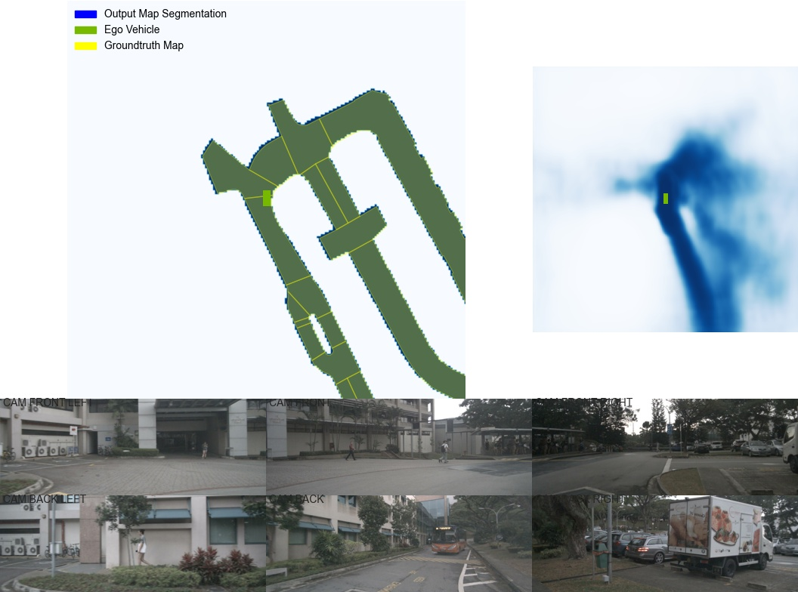

# Multi-Task Lift-Splat Shoot

This repo aims to implement multi-task implementation of the original lift-splat-shoot paper.

## Getting the Dataset
Download nuscenes data from [https://www.nuscenes.org/](https://www.nuscenes.org/).
For Pilotier members, you can download a ready-made dataset in the lss-config submodule. See it's README for more information.

#### Correcting nuScenes Data Path
The DATAROOT folder is simply the nuscenes folder which contains different version, as shown below.

To get the map visualization working, the Map Extension pack (currently v1.3) needs to be downloaded. The maps folder should be placed in the same DATAROOT folder for nuscenes (besides "mini").

The overall structure of the directory will look as follows:

-> nuscenes (_or whatever name you call it_)\
&nbsp;&nbsp;&nbsp;&nbsp;|__ mini\
&nbsp;&nbsp;&nbsp;&nbsp;&nbsp;&nbsp;&nbsp;&nbsp;|__ samples\
&nbsp;&nbsp;&nbsp;&nbsp;&nbsp;&nbsp;&nbsp;&nbsp;|__ sweeps\
&nbsp;&nbsp;&nbsp;&nbsp;&nbsp;&nbsp;&nbsp;&nbsp;|__ maps (_has 4 images_)\
&nbsp;&nbsp;&nbsp;&nbsp;&nbsp;&nbsp;&nbsp;&nbsp;|__ v1.0-mini\
&nbsp;&nbsp;&nbsp;&nbsp;|__ trainval\
&nbsp;&nbsp;&nbsp;&nbsp;&nbsp;&nbsp;&nbsp;&nbsp;|__ ...\
&nbsp;&nbsp;&nbsp;&nbsp;|__ test\
&nbsp;&nbsp;&nbsp;&nbsp;&nbsp;&nbsp;&nbsp;&nbsp;|__ ...\
&nbsp;&nbsp;&nbsp;&nbsp;|__ maps (_from map extentions v1.3_)\
&nbsp;&nbsp;&nbsp;&nbsp;&nbsp;&nbsp;&nbsp;&nbsp;|__ basemap\
&nbsp;&nbsp;&nbsp;&nbsp;&nbsp;&nbsp;&nbsp;&nbsp;|__ expansion\
&nbsp;&nbsp;&nbsp;&nbsp;&nbsp;&nbsp;&nbsp;&nbsp;|__ prediction\
&nbsp;


Finally, the directory structure passed to the program will simply be _/path/to/nuscenes_, for both DATAROOT and MAP_FOLDER.

## Setting the Environment
There are a few options to setting up the environemtn.

#### Pip
 Install dependencies.

```
pip install nuscenes-devkit tensorboardX efficientnet_pytorch==0.7.0
```
The current LST version of pyTorch with CUDA (also works on CPU) is known to work, which can be installed:
```
pip3 install torch==1.8.2+cu111 torchvision==0.9.2+cu111 torchaudio===0.8.2 -f https://download.pytorch.org/whl/lts/1.8/torch_lts.html
```

#### Simple Install with Anaconda on Windows
Simply run the following command to create the conda virtual environment (tested on Windows 10).
The file can be found in lss-config submodule.
```
conda env create -f conda_env.yaml
```
The current LST version of pyTorch is known to work, which can be installed:
```
pip3 install torch==1.8.2+cu111 torchvision==0.9.2+cu111 torchaudio===0.8.2 -f https://download.pytorch.org/whl/lts/1.8/torch_lts.html
```

#### Simple Install with Docker
Simply run the following command to download the docker image, after installing docker on your system.
```
docker pull pilotier/lift-splat-shoot:latest
```
Then, to run the docker image, enter:
```
docker run -it --name NAME -v PATH/TO/NUSCENE_ROOT:/dataset:ro pilotier/lift-splat-shoot:latest
```
where NAME is the name of your docker image, and PATH/TO/NUSCENE_ROOT is the directory that contains the dataset (in this case the nuscenes folder, which contains 'maps' and 'mini').


### Pre-trained Model
Download a pre-trained multi-task segmentation model from here: [-](https://drive.google.com/file/d/18fy-6beTFTZx5SrYLs9Xk7cY-fGSm7kw/view?usp=sharing) 

| Vehicle IOU (reported in paper)        | Vehicle IOU (this repository)         |
|:-------------:|:-------------:| 
| 32.07      | 33.03 |


### Visualize a multi-task model
To visualize on the "mini" split, pass `mini` for VERSION. To evaluate on the "trainval" split, pass `trainval`. To evaluate on the "test" split, pass `test`.
Visualize the multi-task segmentation output by a model:

```
python main.py multi_viz_model_preds VERSION --modelf=MODEL_LOCATION --dataroot=NUSCENES_ROOT --map_folder=NUSCENES_MAP_ROOT
```

As an example, the following command would produce output images as follows:
```
python main.py multi_viz_model_preds mini --modelf=./runs/model10000.pt --dataroot=D:/datasets/mini --map_folder=D:/datasets --video_output=True --channel=1
```


Understanding the parameters:\
`--modelf` : the trained multi-task .pt model.\
`--dataroot` : folder that contains the mini, trainval, and/or test version of the nuscenes dataset\
`--map_folder` : parent folder where the maps expansion pack resides (_should contain a 'maps' folder_).\
`--gpuid` : -1 for CPU, 0 for first GPU, etc.\
`--channel` : 0 for vehicles, 1 for road segmentation, and 2 for lane dividers.\
`--max_frames` : -1 for CPU, 0 for first GPU, etc.\
`--video_output` : if `True`, the output files will be converted into a video called _"video.mp4"_.


&nbsp;


### Train a model (optional)
Train a model. Monitor with tensorboard.

```
python main.py multi_train trainval --dataroot=NUSCENES_ROOT --map_folder=NUSCENES_MAP_ROOT --logdir=./runs --gpuid=0
tensorboard --logdir=./runs --bind_all
```